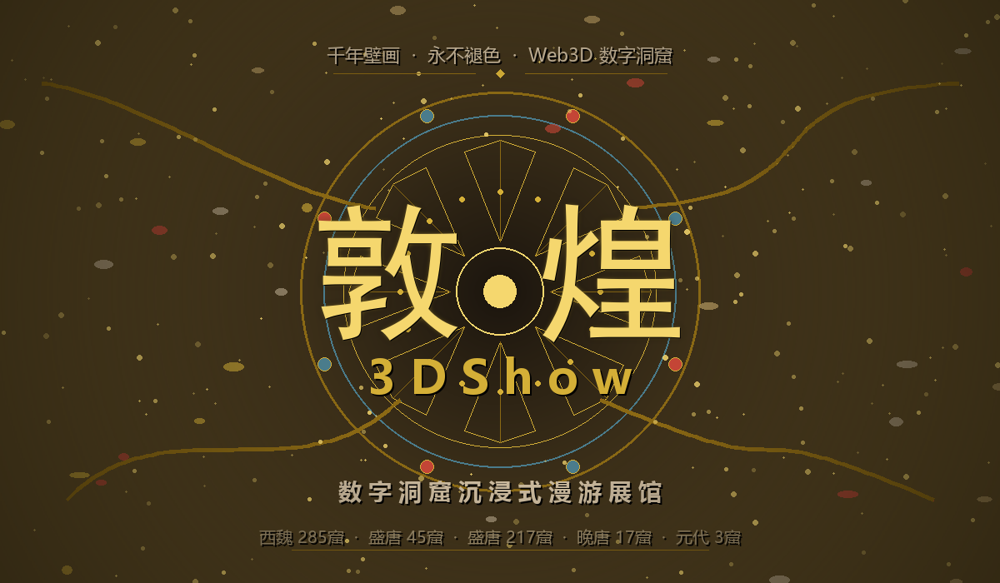

# 敦煌 3DShow 数字洞窟沉浸式漫游展馆

## 项目创意
以"让千年敦煌永不褪色"为理念，用 Web3D 将莫高窟五个代表性洞窟以 1:1 比例复刻至浏览器，涵盖西魏285窟、盛唐45窟与217窟、晚唐17窟藏经洞、元代3窟。打开网页即可漫游千年壁画彩塑，点击展品弹窗阅读文物解说，缩略地图实时定位当前位置。零安装、零下载、全球免费访问。

## 原理说明
三维渲染基于 Three.js 与 WebGL，采用 PBR 物理材质配合 ACES 电影级色调映射，还原石窟石材与壁画颜料质感。模型由 Blender 程序化建模后导出为 GLB 格式，经 Meshopt 压缩后由浏览器端 WASM 实时解码。展品交互通过 Raycaster 射线拾取实现，点击壁画或彩塑触发文物解说弹窗。视角控制融合 OrbitControls 轨道操作、WASD 键盘漫游与滚轮多维球坐标环绕。Service Worker 对模型文件采用 Cache First 策略，二次访问秒开。

## 项目设计思路
项目按功能拆分为场景、光照、模型、材质、结构、控制、拾取、粒子等多个独立模块，通过 ES Module 接口通信，降低耦合度。五间洞窟沿 X 轴中轴线按朝代依次排列，形成从西魏到元代跨越千年的参观动线，左侧隔断墙全部移除以保证漫游时视野开阔。配色提取敦煌壁画矿物颜料色谱，以石青、石绿、朱砂、土黄、赭石五色为基础构建低饱和暖棕体系，界面采用极简博物馆风格，弱化 UI 存在感以突出三维场景内容。

## 数字技术应用路线
整体技术链路从 Blender Python 程序化建模起步，经 GLB 导出与 Meshopt 压缩，进入 Three.js 渲染层，叠加六层分层光照、PBR 材质实例合并与低模空间结构实时生成。交互层融合轨道控制、WASD 漫游、滚轮多维环绕、五洞窟飞行跳转与射线拾取文物解说，配合花瓣、光晕、金沙三重粒子特效增强沉浸感。部署层通过 Service Worker 缓存模型，由 GitHub Actions 自动构建并发布至 GitHub Pages。

## 设计任务流程展示
第一阶段在 Blender 中完成场馆结构与五间洞窟建模，程序化生成壁画纹理与彩塑人像并配置灯光。第二阶段导出 GLB 文件并做 Meshopt 压缩。第三阶段开发 Web 前端，依次搭建场景、六层光照、模型加载、PBR 材质、低模空间结构、视角控制、射线拾取与 UI 界面。第四阶段叠加粒子花瓣、光晕与金沙三重沉浸特效。第五阶段做性能优化与部署，包含延迟加载、Service Worker 缓存、Vite 构建与 GitHub Actions 自动发布。

## 项目创新点与技术难点
项目有六项核心创新。其一，全部场馆与洞窟由 3400 余行 Blender Python 脚本程序化生成，参数可调、可复现。其二，设计六层分层光照系统，从环境光、半球光、定向主光到点光源补光、走廊辅光、焦点聚光逐层叠加，在保留博物馆暗光氛围的同时确保展品细节清晰。其三，采用低模与高模混合策略，展品在 Blender 精细建模，墙体画框等结构在 Three.js 低模实时生成。其四，滚轮支持水平与垂直双维度球坐标环绕观赏。其五，Raycaster 文物解说库收录三十余条词条，按长键优先策略匹配避免误判。其六，金沙粒子按镇馆文物、藻井、环境三区分配，视觉焦点集中。

开发过程中主要攻克六个难点。模型体积通过 Meshopt 压缩配合 Service Worker 缓存控制。光照性能将每洞窟光源精简至三个并辅以材质自发光。Draw Call 经材质实例合并从百余次降至三十以下。WASD 漫游通过平滑缓动插值与减速衰减消除顿挫感。GitHub Pages 子路径部署使用相对路径与 Service Worker 动态作用域适配。粒子系统采用降频更新与 depthWrite 关闭降低 GPU 开销。

## 项目数字化创作过程
三维建模阶段编写 3400 行 Python 脚本，程序化生成 72 米乘 16 米的展馆空间，包含五间差异化洞窟、六种图案配合四个朝代参数的程序化壁画纹理、几何体组合彩塑与矿物色彩体系。Web 前端阶段经多轮调试完成六层光照消除死黑，构建九种 PBR 材质预设并通过实例合并降低 Draw Call，使用 Three.js 实时生成墙体、画框、基座与 Canvas 纹理标题，编写三十余条文物解说词条与带相机位置脉冲标记的缩略导览地图。沉浸特效阶段实现 410 个粒子的三重特效，花瓣、光晕、金沙均使用程序化纹理并降频更新。优化部署阶段通过 requestIdleCallback 延迟加载非关键模块，Service Worker 缓存模型实现二次秒开，Vite 做代码分割，GitHub Actions 自动构建部署，过程中解决了 leftWallMaterial 未定义白屏与 Service Worker 缓存版本过期等关键 Bug。

## 总结
项目综合运用 Blender Python 程序化建模、Three.js WebGL 渲染、Raycaster 文物拾取与粒子特效等技术，在浏览器端流畅运行五洞窟、三十余件可交互展品、410 个粒子与数十个动态光源的复杂三维场景，让千年敦煌在花瓣与金沙中永生。
